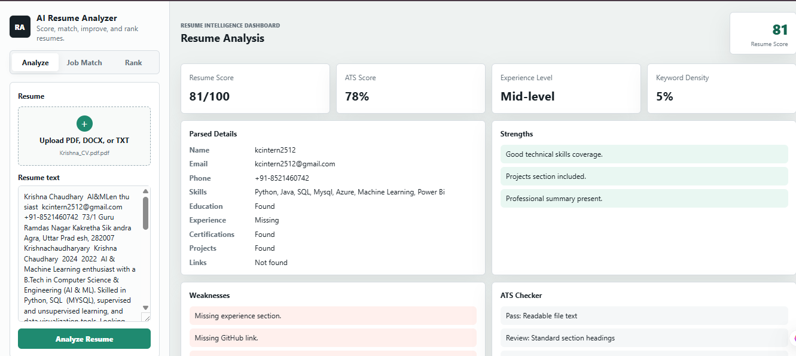

# 📄 AI Resume Analyzer

A browser-based resume analysis tool that helps users evaluate resumes by extracting key information, estimating ATS compatibility, matching resumes with job descriptions, identifying skill gaps, and ranking multiple candidates.

## 📸 Application Preview



## ✨ Features

- 📂 Upload resumes in PDF, DOCX, and TXT formats
- 📑 Extract resume text directly in the browser
- 👤 Parse resume details including:
  - Name
  - Email
  - Phone Number
  - Skills
  - Education
  - Experience
  - Certifications
  - Projects
  - Links
- 📊 Generate a Resume Score (0–100)
- 🎯 Estimate ATS Compatibility Score
- 💼 Match resumes against job descriptions
- 🧠 Identify matching and missing skills
- 📉 Detect skill gaps and provide learning recommendations
- ✍️ Suggest improvements for stronger resume content
- 📝 Detect basic grammar and formatting issues
- 🏆 Rank multiple resumes based on overall performance

## 🛠️ Tech Stack

### Frontend
- HTML5
- CSS3
- JavaScript

## 📂 Project Structure

```
Ai-Resume-Analyzer
│── assets
│     └── dashboard.png
│── index.html
│── styles.css
│── app.js
│── README.md
```

## 🚀 Getting Started

1. Clone this repository.

```bash
git clone https://github.com/Krishnachaudharyary/Ai-Resume-Analyzer.git
```

2. Open the project folder.

3. Open `index.html` in your preferred web browser.

4. Upload a resume and start the analysis.

## 📊 Analysis Includes

- Resume Parsing
- Resume Score
- ATS Compatibility Score
- Skill Extraction
- Job Description Matching
- Missing Section Detection
- Keyword Density Analysis
- Experience Level Detection
- Skill Gap Recommendations
- Resume Improvement Suggestions
- Multiple Resume Ranking

## 🔮 Future Improvements

- Integration with AI/LLM-based resume feedback
- Export analysis report as PDF
- User authentication
- Cloud deployment
- Enhanced grammar analysis
- Support for additional resume formats

## Notes

PDF and DOCX extraction uses browser libraries from public CDNs. If a browser blocks those libraries, paste the resume text into the text box and run the analyzer.

## 👨‍💻 Author

**Krishna Chaudhary**

GitHub: [Krishnachaudharyary](https://github.com/Krishnachaudharyary)

---
